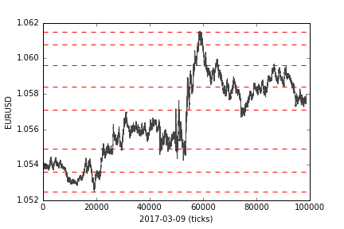
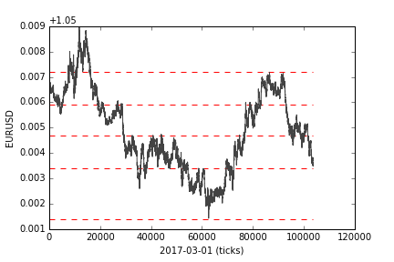

### Determining support & resistance levels using mean shift clustering
The following notebook shows some of this repos functionality,
including getting and storing tickdata for all tickers available on Dukascopy. A clustering algorithm determines S/R-levels, sorts them, filters them, and
plots them.

```{.python .input  n=10}
%matplotlib inline
import numpy as np
import matplotlib.pyplot as plt
from getdayrates import getDayRates
from ordercompute import orderCompute
```

```{.python .input  n=2}
class to_self():
    pass
ts = to_self()
ts.symbol = 'EURUSD'
ts.quantile = 0.1
ts.n_samples = 2000
ts.date = '2017-03-10'

sr_levels = orderCompute(ts).newSR()
```

```{.python .input  n=25}
datesplit = ts.date.split('-')
prior_date = '{}-{}-{}'.format(datesplit[0], datesplit[1], str(int(datesplit[2])-1).zfill(2))
input_train_ = getDayRates.getDayRates(ts.symbol, prior_date)
rate_data = getDayRates.importRates(input_train_)

for i in range(len(sr_levels)):
    plt.plot((0, len(rate_data)), (sr_levels[i], sr_levels[i]), 'r--')

plt.plot(rate_data, '#434343')

plt.ylabel('EURUSD')
plt.xlabel(prior_date + ' (ticks)')
plt.show()
```
*The amount of levels corresponds to the quantile parameter*  
  
  
*Another example with a larger quantile*  
  
